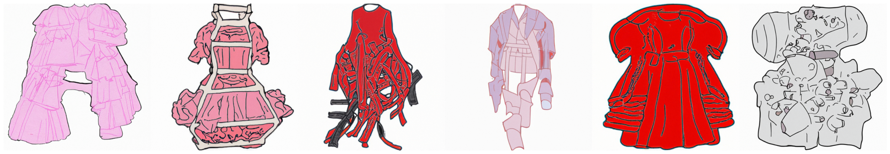
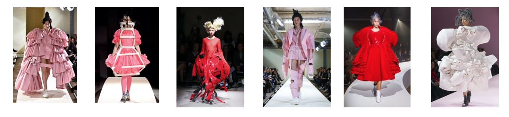
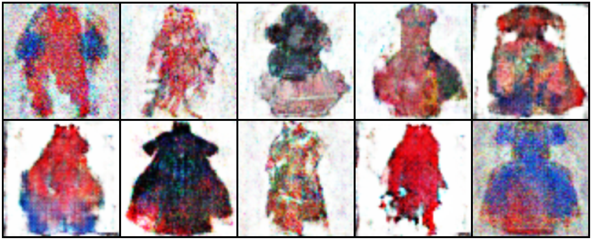
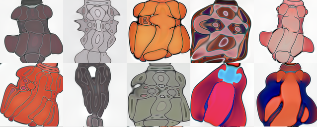
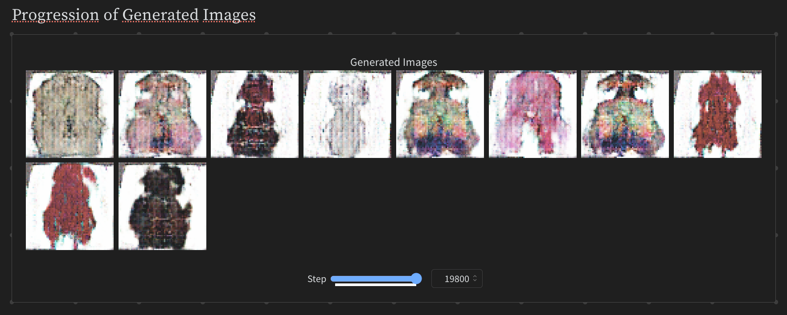

    <h1>AvantGAN</h1>
    

    <h4 align="center">
    <a href="https://huggingface.co/spaces/ellemac/avantGAN" target='_blank'>[HuggingFace Demo]</a> •
    <a href="https://wandb.ai/elles/avantGAN/reports/DCGAN--Vmlldzo4Mzc3MDAx" target='_blank'>[Wandb Report]</a>
    </h4>

(Two) GAN variants that use adaptive discriminator augmentation (ADA) for small datasets that generates avant-garde fashion in style of Rei Kawakubo; currently trained on pieces hand-traced in Adobe Fresco. Results are more abstract/creative than realistic.

To my knowledge, no one has attempted to make a GAN that creates artistic avant-garde fashion.

## Dataset
A tiny tiny dataset of 27 avant-garde fashion pieces by Rei Kawakubo hand-traced in Adobe Fresco to reduce noise and emphasize important features. Original size: 512x512x3 but resized to 64x64x3 for training the DCGAN and 128x128x3 for training StyleGAN3.

*512x512 training samples of hand-traced outfits.*

*Raw samples of Rei Kawakubo's avant-garde outfits.*

## Results
Without ADA: model simply overfits to the small dataset and reproduces nearly the same images as the training set. The following results are therefore *with* ADA.

### Cherry-picked, questionably "creative" generations

    <figure style="flex: 1; margin-right: 20px; text-align: center;">
        
        <figcaption><em>From-scratch DCGAN + ADA trained on 64x64 images</em></figcaption>
    </figure>
    <figure style="flex: 1; text-align: center;">
        
        <figcaption><em>StyleGAN3 (includes ADA) trained on 128x128 images</em></figcaption>
    </figure>

The DCGAN clearly overfits more than the StyleGAN3, which perhaps does not learn the data distribution enough. This is a subjective analysis and should be investigated more thoroughly with metrics like FID.

### (Click for) Slightly more detailed results in wandb report

## Training (on Kaggle)
### DCGAN + ADA
Note: training should take < 20 minutes on Kaggle with 2 T4 GPUs

1. Download avantgarde_high_res.zip from this repo and upload as input data to kaggle
2. Run [train_avantGAN.ipynb](./notebooks/train_avantGAN.ipynb) in Kaggle (sorry!) with 2 GPUs (T4s) active or run locally with minimal changes
2. Change training params and wandb info in class Config
3. Either run interactively as normal or click save version to run training in the background to avoid timeouts.

### StyleGAN3
Note: training can take 12+ *hours* on Kaggle with 2 T4 GPUs

Same instructions as DCGAN + ADA but use [train_styleGAN3.ipynb](./notebooks/train_styleGAN3.ipynb) instead, which does not support wandb logging.

## Architecture/Training Setup
### DCGAN + ADA
Deep convolutional GAN with basic binary cross entropy loss for the discriminator with following changes:
1. Leaky ReLU to generator
2. AdamW optimizer for both generator and discriminator
3. Adaptive Discriminator Augmentation (ADA) per https://arxiv.org/abs/2006.06676 (Karras et al. 2020) for small datasets  
    3.1. Augmentations to the real images as per ADA
4. Basic label smoothing determined by SMOOTH parameter in config

### StyleGAN3
Please refer to paper: https://arxiv.org/abs/2106.12423, which largely uses the architecture from StyleGAN2: https://arxiv.org/abs/1912.04958.

## Comparison to other models
<TODO: diffusion results>

## Future Improvements
* increase dataset size manually and via diffusion generation
* update loss function to e.g. wasserstein loss to decrease mode collapse and improve training stability

### Acknowledgements
* https://pytorch.org/tutorials/beginner/dcgan_faces_tutorial.html as base code for DCGAN
* styleGAN3 https://arxiv.org/abs/2106.12423  
* styleGAN2 https://arxiv.org/abs/1912.04958  
