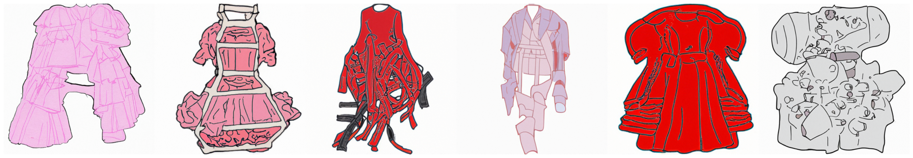
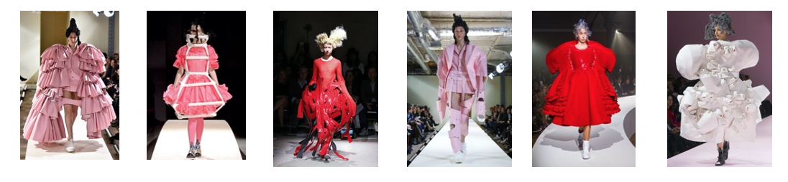

# AvantGAN
This is a WGAN-GP that attempts to create avant-garde fashion; currently trained on pieces by Rei Kawakubo that I hand-traced in Adobe Fresco.

To my knowledge, while GANs that produce simple articles of clothing exist, no one has attempted to make one that creates artistic avant-garde fashion.

Some hand-traced unaugmented drawings used as training images.

Some of Rei Kawakubo's avant-garde outfits the above data is based off of.

## Usage
To train the GAN with original config:
* Open AvantGAN.ipynb in google collab
* Upload avantgarde_drawings.zip to workspace
* Upload all config.json files to workspace
* Run all cells

## Latest Architecture
Deep convolutional GAN with WGAN-GP loss implementation. Note: Each convolution, in both networks, is followed by batch normalization and a leaky ReLU function, except for the last layer, which uses a tanh function. 

### Discriminator Layers
* 1x10 input (z-vector)
* 1x80,000 fully connected
* 25x25x128 transposed convolution (where 128 is # of filters, i.e. # of feature maps)
* 50x50x64 transposed convolution
* 75x75x32 transposed convolution
* 100x100x3 output (synthesized outfit image)

### Generator Layers
* 100x100x3 image input
* 100x100x64 convolution
* 50x50x128 convolution
* 25x25x256 convolution
* 1x1x1 output (generated- vs real-image decision)

## Dataset
About 10,000 mostly augmented images of size 100x100x3. Source images scraped from Google and all outfits are by designer Rei Kawakubo. Traced source images in Adobe Fresco to reduce noise, simplify the images and emphasize important features.

## Improvements
Working on significantly increasing dataset and removing some unnecessary augmented images to have less-noisy data.

### Acknowledgements
Used Python Machine Learning by Sebastian Raschka and Vahid Mirjalili as a guide